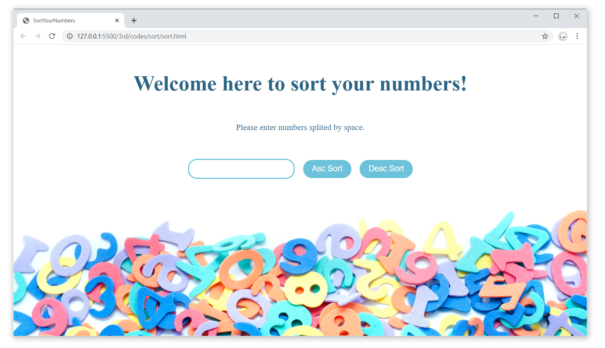

## 要求
1. 练习JavaScript基础，并用JavaScript编写一个快速排序算法，要求在页面上输出原始输入应对列及排序后的结果。
2. 再编写一个网页, 展示你最喜欢电影(最少3个)
- 使这些电影名字的颜色每隔3秒逐个从黑色变成红色
- 在网页上添加一个按钮，当点击该按钮时，它将电影列表上的电影名称进行反序处理，然后在消息对话框中弹出
- 要求分别使用DOM函数和Prototype.js函数完成

## 草图
1. 数字排序

2. 显示电影

## 截图
1. 数字排序

2. 显示电影
