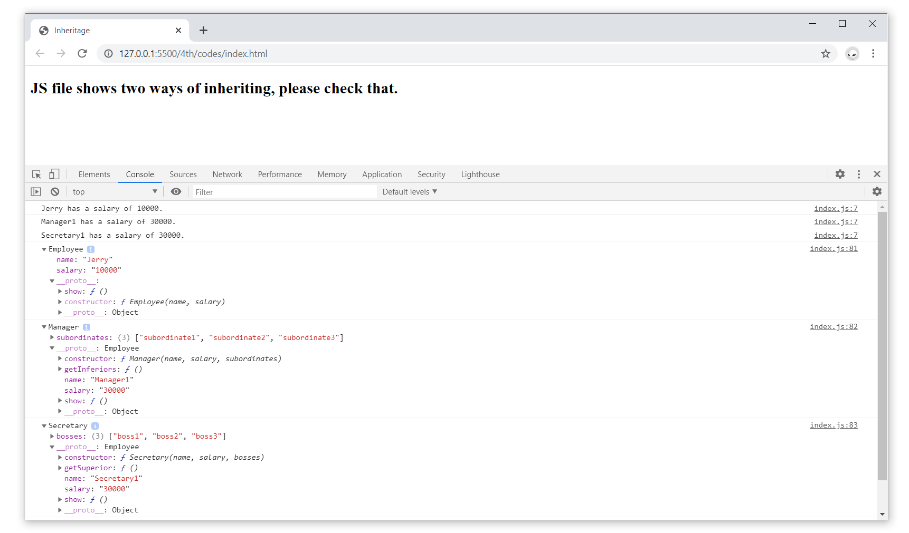

## 要求
在Firebug控制台中用JavaScript编写代码定义Employee, Manager, 和Secretary的类：
- 每个Employee拥有名字和薪水 
- 每个Manager都是Employee, 并且管理一组其他的Employees
- 每个Secretary都是Employee, 并为Manager工作

给这些类添加方法：
- 每个Employee有一个`show()`方法，以字符串的形式返回自己的名字和薪水 
- 每个 Manager有一个 `getInferiors()`方法，返回他的下属 
- 每个Secretary有一个`getSuperior()`方法，返回他的老板 
- 尝试使用两种不同的继承方式, 复制和原型

## 截图
