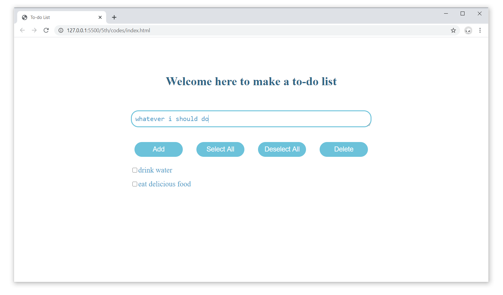

## 要求
在单个页面上编写一个简单的待办事项列表应用，要求:
- 表单使用一个textarea指定一个新待办事项, 和一个add按钮添加这个事项到列表中
- 按钮"select all"、"deselect all"、"remove"用于全选、全不选、删除
- 每个事项有一个checkbox以供选择
- 待办事项列表添加热键
  - "↑" 和"↓"键用来在该列表中上下移动 
  - "Enter" 键用于选中/取消选中当前待办事项列表

## 截图
